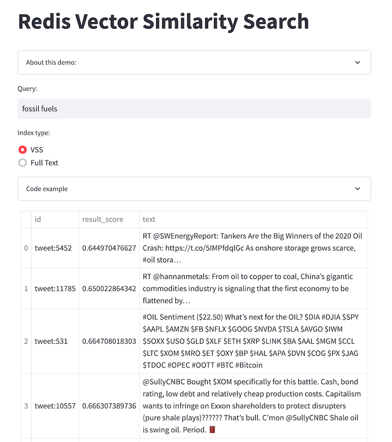

# Redis Vector Similarity Search

## TL;DR

Try always-on Streamlit app that contains the front-end for the project:

https://antonum-redis-vss-streamlit-streamlit-app-p4z5th.streamlitapp.com/



Try queries like:
“Oil”, “Oil Reserves”, “Fossil fuels”

Lexical Full Text search quickly runs out of matches.

Vector search continues to discover relevant tweets.

This demo is using Redis Cloud with Vector Similarity Search and allows you to query database of 12k+ tweets, related to the stock market. You can query the data using either "traditional" lexical/full-text search or Vector Similarity Search.

Variant of BERT model sentence-transformers/all-distilroberta-v1 from Hugging Face is used to generate Vectors from text and Redis is used to perform Vector Similarity Search.

Vectors are generated and loaded into Redis at the Notebook. Source code for ColabNotebook can be found here: [a vector_embeddings_redis.ipynb](vector_embeddings_redis.ipynb)


Click on the "open in cloab" icon to run it.

Same notebook allows you to perform both lexical full-text queries and VSS-based symantic queries. Query frontend is avaliable [online](https://antonum-redis-vss-streamlit-streamlit-app-p4z5th.streamlitapp.com/) and the source code is at [streamlit_app.py](streamlit_app.py)

## Prerequisites

In order to successfully launch the notebook you need either Redis Cloud subscription or Redis Stack deployed locally. Notebook by default would install and use notebook-local Redis Stack instance.

### Redis Cloud

Create Free Redis Cloud subscription. https://redis.com/try-free/

You can start with free forever 30MB Fixed subscription. Make sure you select Redis Stack as a Type. 

After subscription is created - Capture:
- “Public Endpoint” 
- “Default User Password”

Adjust the Redis connection block to use your values:

```
# make sure to enter your values here!!!
host = "redis-18900.c73.us-east-1-2.ec2.cloud.redislabs.com"
port = 18900
pwd="sDv0puwA3oMXNBe3e8gdcBQtYXXXXX"
```

### Running Redis Stack Locally

Install redis stack locally. Follow the instructions here: https://redis.io/docs/stack/get-started/install/

For instance to run it in Docker use:
```
docker run -d --name redis-stack-server -p 6379:6379 redis/redis-stack-server:latest
```

Or to run it natively on Mac, including Mac silicone M1/M2:

```
brew tap redis-stack/redis-stack
brew install redis-stack
```

### Running Streamlit app locally

Install dependencies:
```
pip install -r requirements.txt
pip install streamlit
```

Run Streamlit app:
```
streamlit run streamlit_app.py
```
To specify custom Redis URL/PAssword - use create `.streamlit/secrets.toml` from `.streamlit/secrets.toml.template` and replace values with your own.